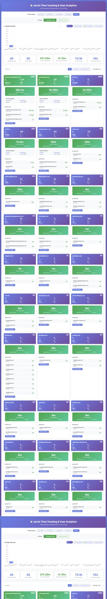

# Jarvio PostHog Analytics Dashboard

A self-contained analytics dashboard that visualizes PostHog customer usage data with time-series charts, user-level breakdowns, and date filtering.



## ✨ Features

- **Time-series charts** — Daily activity trends per customer with Chart.js
- **User-level insights** — Per-user time tracking, events, and flow analytics
- **Date range filtering** — Preset ranges (7d, 30d, 60d, All) with custom picker
- **Organization drill-down** — Click any customer to see detailed user breakdowns
- **Smart time correction** — Fixes PostHog's 240-minute session cap by redistributing from org totals
- **Self-contained** — Single HTML file with all data embedded, no server required
- **Zero dependencies** — Python scripts use stdlib only

## 🚀 Quick Start

```bash
git clone https://github.com/jyan366/jarvio-posthog-analytics.git
cd jarvio-posthog-analytics
open dashboard.html    # macOS (or xdg-open on Linux)
```

That's it — the dashboard ships with sample data already embedded.

## 🔄 Update with New Data

1. Export your PostHog report as markdown (see `data/sample_report.md` for format)
2. Run the refresh script:

```bash
./refresh.sh path/to/your_report.md
```

Or step by step:

```bash
python3 src/parse_report.py data/your_report.md data/customer_data.json
python3 src/generate_dashboard.py data/customer_data.json dashboard.html
```

## 📁 Project Structure

```
├── dashboard.html          # The dashboard (open in browser)
├── refresh.sh              # One-command data refresh
├── src/
│   ├── parse_report.py     # Markdown report → JSON
│   └── generate_dashboard.py  # JSON → embedded HTML dashboard
├── data/
│   └── sample_report.md    # Example PostHog report
├── tests/
│   ├── test_pipeline.py    # End-to-end pipeline tests
│   └── test_accuracy.py    # Data accuracy validation
└── screenshot.jpg
```

## 📊 Report Format

The parser expects PostHog markdown reports with this structure:

```markdown
### customer-domain.com

**Key Metrics:**
- Active Users: **5**
- Total Events: **1,234**
- Avg Session Time: **~60 minutes**

**Daily Activity:**
- 2026-02-01: 100 events
- 2026-02-02: 200 events

**Users:**
- user@example.com: 500 events, 30m time, 10 flows
```

See `data/sample_report.md` for a complete example.

## 🚢 Deploy Options

- **Local**: Just `open dashboard.html`
- **GitHub Pages**: Push to repo, enable Pages on `main` branch
- **Vercel/Netlify**: Drop the repo — it's a static site
- **Share**: Send `dashboard.html` as a single file — it's fully self-contained

## 🧪 Tests

```bash
python3 tests/test_pipeline.py
python3 tests/test_accuracy.py
```

## License

MIT
